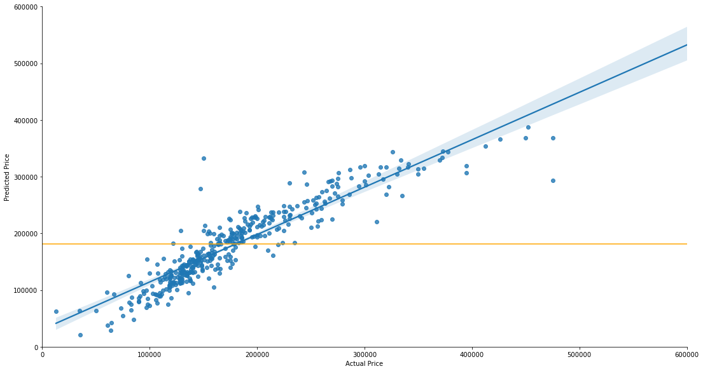
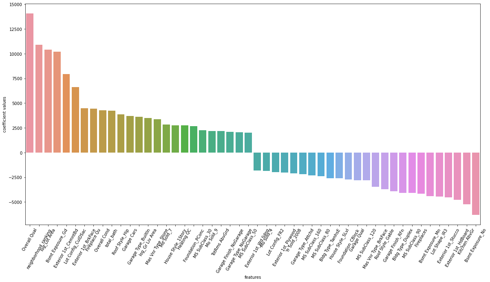

# Project 2: Ames Housing Data and Kaggle Challenge

---

## Problem Statement:
- Creating a regression model based on the Ames Housing Dataset. This model will predict the price of a house at sale.
- The main target audience will be property agents having trouble evaluating the price of each property in ames.

---

### Background:
Ames is a city in the state of Iowa of Unite States. In 2020, Ames had a population of about 66,000. Majority of the population are in the 15-30 years age range (roughly 50%). As of 2010, which is in the same period as our project, there were 23,876 housing units. Our model will be based on about 2000 datasets , which is roughly 10% of the total housing units. The average household size was 2.25 and the average family size was 2.82. In 2010, Ames had a real per capita income of $30,128. ([*source*](https://www.deptofnumbers.com/income/iowa/ames/)). These numbers give an indication on the types of house built in Ames and how it is priced, which we will look at later. ([*source*](https://en.wikipedia.org/wiki/Ames,_Iowa#cite_note-wwwcensusgov-15))

Another interesting point to note is that the number of housing units outpaced the growth in total households. This could mean that supply is more than demand. However one cannot be sure, especially with data showing that 30% of householders are living alone ([*source*](https://www.icip.iastate.edu/sites/default/files/2010census/2010census_1901855.pdf)). So the increased supply of housing units could be due to individuals who chose to stay alone. Either way, we will attempt to predict the housing price based on multiple features.

Equipped with this knowledge, we set to achieve a good model prediction for house sales price based on datasets of various house features from 2006-2010.

---

### Datasets selected:
- train.csv
- The dataset provides data on 81 different features related to the housing units in Ames. These features are separated between categorical and numerical variables.

|Feature|Type|Dataset|Description|
|---|---|---|---|
|Id|object|train.csv|ID of house
|MS SubClass|object|train.csv|The building class|
|MS Zoning|object|train.csv|Identifies the general zoning classification of the sale|
|Lot Frontage|float64|train.csv|Linear feet of street connected to property|
|Lot Area|int64|train.csv|Lot size in square feet|
|Street|object|train.csv|Type of road access to property|
|Alley|object|train.csv|Type of alley access to property|
|Lot Shape|object|train.csv|General shape of property|
|Land Contour|object|train.csv|Flatness of the property|
|Utilities|object|train.csv|Type of utilities available|
|Lot Config|object|train.csv|Lot configuration|
|Land Slope|object|train.csv|Slope of property|
|Neighborhood|object|train.csv|Physical locations within Ames city limits|
|Condition 1|object|train.csv|Proximity to main road or railroad|
|Condition 2|object|train.csv|Proximity to main road or railroad (if a second is present)|
|Bldg Type|object|train.csv|Type of dwelling|
|House Style|object|train.csv|Style of dwelling|
|Overall Qual|int64|train.csv|Overall material and finish quality|
|Overall Cond|int64|train.csv|Overall condition rating|
|Year Built|int64|train.csv|Original construction date|
|Year Remod/Add|int64|train.csv|Remodel date (same as construction date if no remodeling or additions)|
|Roof Style|object|train.csv|Type of roof|
|Roof Matl|object|train.csv|Roof material|
|Exterior 1st|object|train.csv|Exterior covering on house|
|Exterior 2nd|object|train.csv|Exterior covering on house (if more than one material)|
|Mas Vnr Type|object|train.csv|Masonry veneer type|
|Mas Vnr Area|float64|train.csv|Masonry veneer area in square feet|
|Exter Qual|int64|train.csv|Exterior material quality|
|Exter Cond|int64|train.csv|Present condition of the material on the exterior|
|Foundation|object|train.csv|Type of foundation|
|Bsmt Qual|int64|train.csv|Height of the basement|
|Bsmt Cond|int64|train.csv|General condition of the basement|
|Bsmt Exposure|object|train.csv|Walkout or garden level basement walls|
|BsmtFin Type 1|object|train.csv|Quality of basement finished area|
|BsmtFin SF 1|float64|train.csv|Type 1 finished square feet|
|BsmtFin Type 2|object|train.csv|Quality of second finished area (if present)|
|BsmtFin SF 2|float64|train.csv|Type 2 finished square feet|
|Bsmt Unf SF|float64|train.csv|Unfinished square feet of basement area|
|Total Bsmt SF|float64|train.csv|Total square feet of basement area|
|Heating|object|train.csv|Type of heating|
|Heating QC|int64|train.csv|Heating quality and condition|
|Central Air|object|train.csv|Central air conditioning|
|Electrical|object|train.csv|Electrical system|
|1st Flr SF|int64|train.csv|First Floor square feet|
|2nd Flr SF|int64|train.csv|Second floor square feet|
|Low Qual Fin SF|int64|train.csv|Low quality finished square feet (all floors)|
|Gr Liv Area|int64|train.csv|Above grade (ground) living area square feet|
|Bsmt Full Bath|float64|train.csv|Basement full bathrooms|
|Bsmt Half Bath|float64|train.csv|Basement half bathrooms|
|FullBath|float64|train.csv|Full bathrooms above grade|
|HalfBath|float64|train.csv|Half baths above grade|
|Bedroom AbvGr|int64|train.csv|Number of bedrooms above basement level|
|Kitchen AbvGr|int64|train.csv|Number of kitchens|
|Kitchen Qual|int64|train.csv|Kitchen quality|
|TotRms AbvGrd|int64|train.csv|Total rooms above grade (does not include bathrooms)|
|Functional|object|train.csv|Home functionality rating|
|Fireplaces|int64|train.csv|Number of fireplaces|
|Fireplace Qu|int64|train.csv|Fireplace quality|
|Garage Type|object|train.csv|Garage location|
|Garage Yr Blt|float64|train.csv|Year garage was built|
|Garage Finish|object|train.csv|Interior finish of the garage|
|Garage Cars|float64|train.csv|Size of garage in car capacity|
|Garage Area|float64|train.csv|Size of garage in square feet|
|Garage Qual|int64|train.csv|Garage quality|
|Garage Cond|int64|train.csv|Garage condition|
|Paved Drive|object|train.csv|Paved driveway|
|Wood Deck SF|int64|train.csv|Wood deck area in square feet|
|Open Porch SF|int64|train.csv|Open porch area in square feet|
|Enclosed Porch|int64|train.csv|Enclosed porch area in square feet|
|3Ssn Porch|int64|train.csv|Three season porch area in square feet|
|Screen Porch|int64|train.csv|Screen porch area in square feet|
|Pool Area|int64|train.csv|Pool area in square feet|
|Pool QC|int64|train.csv|Pool quality|
|Fence|object|train.csv|Fence quality|
|Misc Feature|object|train.csv|Miscellaneous feature not covered in other categories|
|Misc Val|int64|train.csv|$Value of miscellaneous feature|
|Mo Sold|object|train.csv|Month Sold|
|Yr Sold|object|train.csv|Year Sold|
|Sale Type|object|train.csv|Type of sale|
|SalePrice|int64|train.csv|Property price in dollars|
|combined_living_area|float64|train.csv|total living area|
|total_bath|float64|train.csv|total bathrooms|
|age_Year Built|int64|train.csv|number of years since home built|
|age_Year Remod/Add|int64|train.csv|number of years since home remod/add|
|age_Garage Yr Blt|int64|train.csv|number of years since garage built|
|neighborhood_ranking|int64|train.csv|neighborhood ranking based on categories|

---

## Findings
- Some datas were missing and had to be imputed using several techniques such as imputing the mean value, assigning 0 values, and assigning as none.
- 1 outlier was corrected using median.
- Further Exploratory Data Analysis (EDA) showed multiple need to remove certain features that would adversely affect our model prediction.
- These includes removing one of two features with multicollinearity, removing certain features with very low correlation to SalePrice, and engineering new features to get more insights and achieve a better  prediction model.
- Further data preprocessing was required such as removing features that have only 1 value or class dominating.
- 3 models were considered for our datasets, with the Ridge Regression Model coming up as the best prediction model for SalePrice.

- The plot above shows the predicted vs actual value of our test dataset. Our model clearly outperforms the null model (orange line) and is a good predictor of SalePrice based on the features input.
- With an R2 score of 0.855, it means 85.5% of variations can be explained by our model, which is a relatively good predictor.
- In general the chart below shows the top 25 features that affects SalePrice positively and negatively.

---

## Conclusions/Recommendations
- In conclusion, our model has provided sufficient information for property sales agent to better price their properties using features selected. The model is able to explain 85% of the variations and that can be considered good for the case of property sales agent.
- It is highly recommended for property sales agent to emphasize on the following positive affecting and negative affecting features in relation to SalePrice.

- POSITIVE FEATURES TO INCLUDE
- Overall material and finish quality
- Neighborhood Ranking (for neighborhoods in the top category 'Timber', 'Blmngtn', 'Veenker', 'Somerst', 'NoRidge', 'StoneBr', 'NridgHt')
- Lot Area (an increase of 100 sq foot leads to increase in SalePrice of approximately $10,000)
- Exterior Covering using Cement Board
- Fireplace Quality
- Total bathrooms (the more the better)
- Built-in garage (the space above the garage seems to be highly valued in Ames, as opposed to a normal attached garage)

- NEGATIVE FEATURES TO AVOID
- Basement Exposure (No exposure in basement fared the worst, Ames residents love their sunlight)
- Number of Kitchen AbvGround
- Exterior Covering using Hard Board
- Exterior Covering using Stucco
- Irregular lot shape
